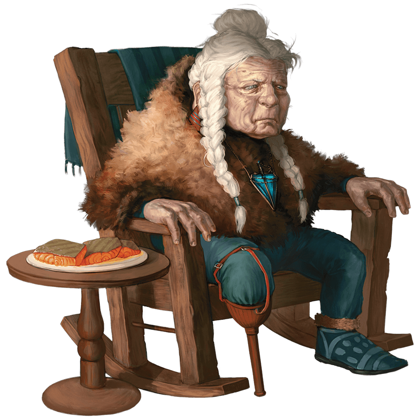

2020-01-25

## The matron mother, Hethyl Arkorran

Fastbatch meets Yzma who is coming back up the stairs. They request permission
from the attendant to go into Hethyl's room. They are allowed to pass. It's
chilly in the room despite a roaring fire. The bedroom is small and all of the
furniture is slightly smaller than human-sized. Hethyl is a dwarf with a peg leg
on her right foot.

Hethyl greets Fastbatch and Yzma by name and she names the other members of
their group. She has anticipated the group's arrival. The group learns the
following information while speaking to Hethyl:

- The Knights of The Back Sword are not allied with Auril
- The knights serve Levistus
- Many knights claim to speak to Levistus but only Hethyl has his ear
- The knights do Levistus' bidding in exchange for great powers
- The knights were excited about Yzma's book

She tells the two that she has tortured, killed, and deprived others in exchange
for dark blessings. She has nothing more to offer Levistus so he has nothing to
offer her. She will soon die but she has been told to deliver one last message.

> 'I've been dreading this moment. My soul is going straight to Nine Hells when
I die but I have a message to deliver first.' - Hethyl Arkorran

She advises the characters to get what is theirs while they are here and not
worry about the incomprehensible. Auril is an inconvenience. Xardorok Sunblight
is a pressing problem.

- Xardorok Sunblight, a duergar warlord, plans to conquer Icewind Dale
- He has a fortress on the surface, hidden in the Spine of the World
- The fortress contains a forge powered by the still-beating heart of a dragon
- Xardorok is using the forge to craft a great weapon made of chardalyn

As she foretold, she dies at the end of the conversation.

Fastbatch heads down to the great hall after retrieving the black
[chardalyn](https://frostmaiden.assimilate.dev/assorted-lore/) amulet from
Hethyl. He observes the feast preparations. He spends time with the amulet and
it begins having an affect. Shortly after, Yzma and Fastbatch retire to prepare
for the feast. She dresses and summons her cobra familiar.

## A boy amongst dogs

Titus, Thoval, Neville, and Jim all head outside to the kennel where they saw
the boy. Titus communicates with the boy telepathically. The boy is named
Alassar Sulmander. He was found stowing away inside a create that was delivered
to Avarice from Calimshan. He stowed away to escape the slave ship he was
trapped on in the south. Avarice cast a spell on him to remove his capacity for
human speech and now he performs menial chores for the knights.

Titus unfreezes and refreezes water to bust the lock and jailbreak the boy. The
group then follows A to the northwestern part of the castle where the boy knows
there is a secret door that leads down into the lower parts of the castle.
Before leaving, Jim throws some rations into the dog pen in a plan to distract
the dogs.

Clearing away some half-frozen bags of flour from the storeroom reveals a hatch
in the floor. Crawling down the hidey-hole they find themselves on a small
landing. They are faced with two choices: a frozen creek and a dark hall. In the
creek is a small rowboat.

Alassar says he is unsure if there is an exit from here. He only knew that it
was a decent place to hide. Thoval and Jim discuss a possible plan to return the
boy to the cage, accept _temporary_ defeat, and return to jailbreak him later.
Titus objects because he cannot bear to put the boy back in bondage. Jim
relents.

At this point the group decides to split.

Neville and Jim head back so as to not be late for dinner. Along the way discuss
what they would like to ask the knights: How the Frostmaiden's Rime has affected
life, commerce, etc.

Thoval and Titus stay intending to find another exit. Down the dark hallways are
for dead bodies recognized at cultists by their amulets. Titus takes the
amulets. Faced with no exit except potentially by the creek, they leave Alassar
and tell him to try to escape if they don't come back within three hours.

## Bad vibes and good food

The feast begins. Everyone stands around the table in front of their chairs;
they are waiting for something. The food arrives and still nobody sits. The food
is obviously fresh. Some chit-chat between themselves. All except the players
are dressed in common, drab robes.

A rotund tiefling soon to be known as Kadroth appears on the landing above the
great hall and haughtily observes the scene with a wry smile.

> 'I think it's completely normal that we walked into a place where we had to
speak the password "Churning Blood"' - Fastbatch Cumberbender

The paunchy, red half-devil announces his special guests. Nobody sits until he
sits. Finally Kadroth relents then sits and the feast begins.

During the course of dinner conversation the group learns to following:

- Crannoc is ill and hasn't come out of his quarters except when absolutely needed
- Avarice is not at the dinner to the disappointment of others
- Avarice is too busy adventuring on business with The Arcane Brotherhood
- Avarice is looking for a powerful lost city underneath the [Reghed glacier](https://frostmaiden.assimilate.dev/assorted-lore/)
- Avarice has two pet Gargoyles: Gargle and Gurgle
- The knights would sacrifice if it meant gaining power with their master
- Kadroth is happy about Hethyl's death; he sees it as an opportunity
- Levistus is chained in Stygia and has a blood feud with Asmodeus

Kadroth is obviously stand-offish and perturbed when anyone outside of Yzma
approaches or speaks to him directly. Even when Yzma proposes a toast he is
taken aback by the audacity. Kadroth uses order to maintain control. Each
outburst is irksome but he seems to swallow his rising temper each time.    

Kadroth proposes a business partnership and an alliance with the group. He
political power, magical means, rank within the knights, 250 gold, and a dog
sled with dogs to each player. In return, he asks that the group bring back
proof that they have eliminated the duergar forward encampment at Kelvin's
Cairn.

He tries to distance himself from Fastbatch as he approaches the head of the
feast. Kadroth forcefully reiterates that Speaker Crannoc is under isolation
with a strange disease. He tries to get the dinner back in order.
