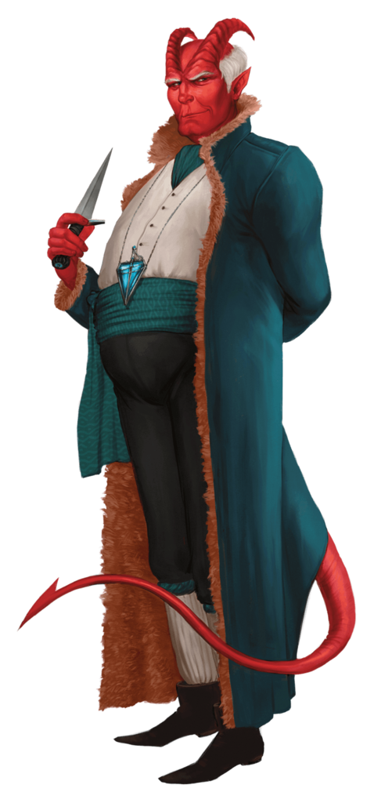
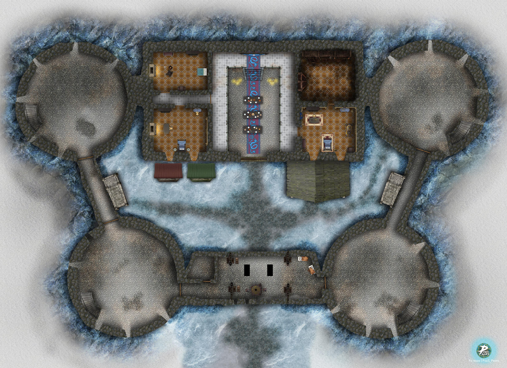
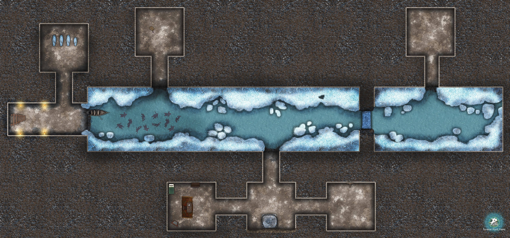
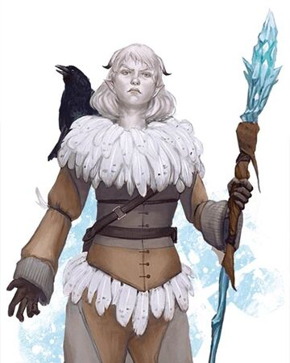

2021-02-22

## Dinner guests

Shortly before concluding dinner, Kadroth offers each of the characters 250 gold
plus 350 gold in sled and dogs in exchange for neutralizing the Duergar threat
at Caer Konig. In addition to the monetary rewards, each person will receive
initiate rank in the Knight of the Black Sword as well as the magical means and
political access that comes with.

The other knights who have joined you for dinner are friendly and this is the
first time in months you've seen fresh, colorful food.

The outbursts, questions, and tomfoolery at dinner have obviously annoyed
Kadroth. He keeps his distnace from Fastbatch, calms the situation, and then
retires to his quarters. He invites his guests to join him to speak business if
they see fit. If they do not plan on accepting the deal he has offered, his
hospitality ends in the morning and they are expected to leave.

## Digestif

Everyone has different priorities after dinner.

- Jim, Neville, and Fastbatch head off to visit Speaker Crannoc Siever
- Thoval and Titus take a "brisk walk" intending to find Allasar
- Yzma heads to Kadroth's quarters to talk business

### Thoval and Titus

Out for a walk in the courtyard, Thoval and Titus notice all guards are
observing their path closely. They act casual and discuss their theories about
why the rest of the group doesn't seems to care about Allasar; unable to be
heard over the howling winds.

In an effort to break Thoval, Titus creates a situation. He loudly proclaims a
need to "piss and shit at the same time." He makes it impossible for the guards
to look away. Thoval sneaks away.

> "That's one of the finer points of trading chickens to dwarves" - Thoval

Three guards surround Titus. One of the guards gives up their name when asked:
Warmond Antonello. Titus continues to play the guards. During his performance
the guild hall doors bust open. Neville runs into the courtyard leaving behind a
room full of chaos. Titus reaches up, grabs the remaining two guards, and puts
them directly to sleep. They both collapse into the snow.

### Yzma

The room off the west side of the great hall is Kadroth's den. A holding room
for visitors. THe den is warm and inviting but Yzma is here for business. The
door to Kadroth's quarters is watched by a diminutive and obstinate fellow.
Thoob is hopelessly loyal to Kadroth and desperately seeks his favor. To
audience with Kadroth, Yzma promises to kill a suitor of the girl who has
Thoob's eye: Irma

> "I don't think you know what 'conversation' means" - Yzma, to Fastbatch

Kadroth provides the following:

- Levistus will pay handsomely to neutralize the Duergar threat
- He is only doing what Levistus asks, he cannot provide justification
- He cannot fight the Duergar because his role is to lead the knights
- Everyone has a role to play
- The deal hinges on the whole group going joining forces
- Kadroth is  worried about traitors

Back in the den, she hears a commotion in the hall. She spots Fastbatch heading
back up the the east landing.

### Jim, Fastbatch, and Neville

Jim, Fastbatch, and Neville seek Speaker Crannoc Siever. The group finds a
knight watching one of the two doors in the hall. They assault the guard and,
after a series of mishaps, fell him with a rapier to the ribs. Jim drags the
body away but the commotion summons another knight. Neville spears the knight
off the second level landing. The knight is dead and chaos is unleashed in the
great hall.

Fastbatch heads inside Crannoc's room which is pitch black. Fastbatch lights a
torch and sees beady eyes staring at him from a corner. The eyes are attached
to a hunched, gaunt, and pale figure which lunges. Fastbatch dodges and realizes
the figure is Speaker Siever.

> "Stay back! I know you have Dragonpox" - Fastbatch

Thought Fastbatch claims to be taking control of the knights, Crannoc quickly
realizes he's full of shit. Crannoc tells Fastbatch that the knights have
trapped him here with no light and little food. The Black Sword forcibly took
over his residence. He's starving and desperate to escape. Upon finding that the
Speaker is not in charge, Fastbatch is uninterested. He leaves the door unlocked
for Crannoc to escape by his own means.

Neville picks himself up from the destroyed table, notices the knight he speared
is unconscious, and casts dancing lights on the remainder of the knights
watching in disbelief. Because the knights have all been saved by a disembodied
light, they assume Neville has the powers of Levistus on his side and are
terrified. Neville busts out of the door without his cold-weather gear.

Jim sees Crannoc hobbling out of the room behind Fastbatch. The great hall is
in total chaos with several knights running from globes of light. Jim catches
Crannoc and promises to help him out of the castle. Jim helps Crannoc finds some
clothing.

## All together now

Fastbatch and Yzma bicker through the castle before returning to Kadroth and
attacking him. She disguises hersalf as Hethyl Arkorran. Fastbatch is under the
influence of the amulet and doesn't have time for Yzma.

Realizing Thoval has escaped, Titus heads toward the secret hatch in the north
west tower.

Jim helps Crannoc escape and follows Titus to the tower.

Neville evades a guard and follows a figure he doesn't know is Titus because he
needs to get out of the weather. Neville runs up the stairs, heads outside along
the castle walls, and barrels through a group of knights. His luck eventually
runs out and he becomes overwhelmed and knocked unconscious.

Thoval is in the quiet, cold, dark cistern. He finds Allasar and comforts him
with stories of his past, goatball, and Oyaminartok and his Goliath brothers.

## Beneath the castle

Spells fire, hands slip on icy rungs, and everyone unceremoniously makes their
way down into the cistern where

Titus gets a running start and makes an inspired leap into the boat to knock
Kadroth into the freezing water. Titus freezes the water around Kadroth and
Fastbatch begins to reel him in with his whip. Fastbatch tries to decapitate
Kadroth which causes a scuffle with Yzma and Jim. During the melee Jim ends up
with his hands on the amulet and a strange, noticeable look overtakes his visage.
Fastbatch lashes out at Jim with his axe. Jim strikes back. Fastbatch ends the
brawl by knocking Jim unconscious.

Thoval has heard the hatch open several times. He sees Kadroth run past and then
another splat as Fastbatch hits the ground. He steps out into the hallways to
see the commotion. Thoval watches in horror and shields Allasar from the
horrible sight and flying blood.

Titus is appalled by the violence so he hauls Jim unconscious into the boat and
contacts his subconscious mind via an empathetic connection to soothe Jim into
a stable condition. He calls over Thoval and Allasar who join him in the boat.

Thoval and Titus (and Jim) row off down through the frozen creek in the cistern.
As the pass a landing the notice a light moving through the darkness. They
continue to row and reach a wall. They turn back around and see that the source
of the light is Avarice. The white tiefling is floating a short distance above
the water holding an icy staff imbued with light.

## Avarice

Avarice turns left so she does not seem to notice Thoval and Titus in the boat.
While they debate what to do, Avarice continues to walk towards Yzma and
Fastbatch. She immediately sees through Yzma's disguise. Fastbatch attempts to
grapple her with the whip and upon hitting her is transported to the elemental
plane of ice. He is in the place where he was, same floor-plan, but everywhere
is ice and it is brutally cold. Yzma asks a few questions and makes a few
comments. She receives a firebolt in response and plays dead assuming there is
no way to win.

Titus and Thoval head back to the landing and Thoval goes in first to the icy
room attached to the landing. They see a large pillar of ice wrapped in chains
with a small white tiefling encased within. There is brown mold behind the
pillar.

Fastbatch spends a few moments trapped in the ice plane tasking serious cold
damage but eventually wills himself back.

Avarice is tailed by Yzma's familiar. Avarice encounters a few knights who tell
them about the group's actions. She seems to be uninterested and tells them to
dump Neville in the cistern "with the rest of the bodies."" She walks off to
prepare her sled.

Thoval find a lever which opens the wall that was previously blocking the boat.

Yzma (as Hethyl) and Fastbatch (appearing from nowhere back from the ice plane)
convince the knights to simply leave Neville's body.

Thoval and Titus head farther down the frozen creek. Thoval leads the way down a
narrow hallway into a dark room. In the room it smells like filth. He's attacked
suddenly by five moving bodies. He cleaves the first one that lunges in twain.

Titus hears the commotion and runs in behind. The light shows 4 figures cowering
in fear after their comrade has been slain. These are workers from the castle
that were planning to jailbreak by attacking the next knight that came in.

Titus and Thoval return with the prisoners. They begin ferrying them upstairs
along with the unconscious bodies. Fastbatch and Yzma bicker among themselves
about the amulets. They end up attacking each other. Yzma knocks out Titus and
Titus knocks out Yzma.

Thoval and Titus tie up all of their party members and escort / carry all others
to Kadroth's quarters with a plan to long rest behind barricaded doors.

_Image Credit livefuntravel.com_
